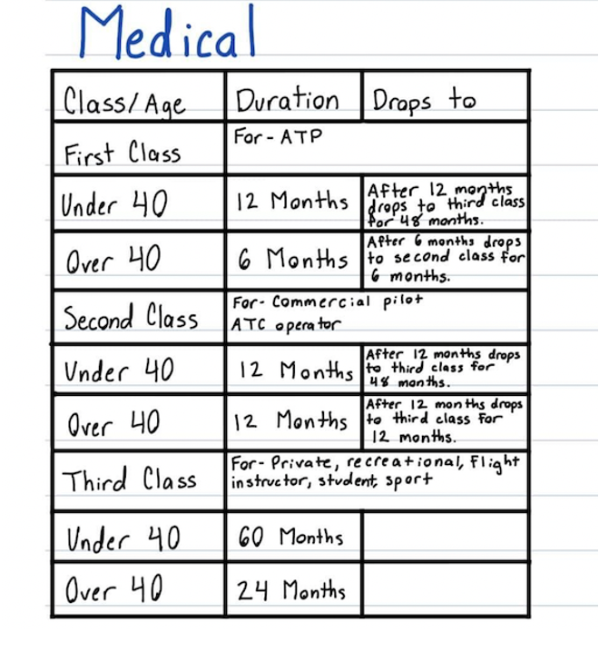

# BDD Requirements Challenge - Pilot Medicals

This repository contains a sample solution to the final exercise in the Serenity Dojo [BDD Requirements Discovery Training](https://expansion.serenity-dojo.com/courses/agile-requirements-discovery-blueprint) course.

The goal of this exercise is to analyze the following user requirement, to define a set of business rules and key examples and counter-examples, 
and to write a set of executable specifications corresponding to these rules and examples.

## The Problem Domain - FAA Medical Examinations

In the Aviation industry, pilots need to have regular medical examinations to ensure that they are fit to fly. The requirements you will be analysing the FAA (Federal Aviation Administration) rules on how often these examinations must take place.

For the purposes of these rules, there are three categories of pilot licenses:
 - 1st Class (commercial airline pilots)
 - 2nd Class (other commercial pilots)
 - 3rd Class (recreational pilots)

Any pilot needs a valid medical certificate to fly. Medical certificates expire in 6 - 60 months depending on age and class:
 - 1st Class (ATP): Every 12 months if younger than age 40, Every 6 months over 40
 - 2nd Class: Every 12 months
 - 3rd Class: 2 Years if over 40, 5 years if under 40

There are also some special rules about what happens when a medical certificate expires:
  - For pilots under 40:
    - A 1st or 2nd class license drops to 3rd Class for 48 months after 12 months
  - For pilots 40 or over:
      - A 1st class license drops to 2rd Class for 6 months after 6 months
      - A 2nd class license drops to 3rd Class for 12 months after 12 months
  - A 3rd class license that expires cannot be used to fly 
  
All of the FAA validities are measured from the last day of the month.

## The Exercise

The aim of this exercise is two-fold:
 - Create an Example Map identifying the key rules, examples and counter-examples in this domain.
 - Define BDD scenarios for these rules and examples

One simple approach is to specify these requirements in two feature files: 
 - `date_of_next_medical.feature`, which will contain the business rules and calculations related to figuring out when a given pilot is due for a medical examination.
 - `certificate_expiry.feature`, which will contain the business rules related to what happens when a medical certificate expires, depending on the age of the pilot and the type of license.

## Getting feedback on your solution
The sample solutions provided in this repository are one possible solution, but there are others. 
If you are a student of the [Serenity Dojo Programme](https://www.serenity-dojo.com/), don't forget to submit your own worked solution in order to get feedback from the Serenity Dojo coaches.
